# Confluent / ThingsBoard Demo

## Intro
This is an IoT demo integrating Confluent Cloud and IoT platform [ThingsBoard](https://thingsboard.io/). ThingsBoard provides device APIs, device management constructs, and IoT dashboarding. Confluent Cloud serves as the serverless telemetry persistence layer, stream processing engine, and streaming data integration platform to downstream data platforms like S3.

## Prerequisites

* ThingsBoard Cloud account. Sign up for a trial [here](https://thingsboard.cloud/).
* Confluent Cloud. Sign up for a trial [here](https://confluent.cloud/signup).
* Node / npm for running the fleet simulator

## Confluent Cloud provisioning

* Create a Basic Confluent Cloud cluster
* Generate a Kafka API key and secret to be used in the Kafka rule node setup in the next section. E.g., via the `confluent` [CLI](https://docs.confluent.io/confluent-cli/current/install.html#scripted-installation):
```
confluent login --prompt --save  // enter your user credentials
confluent environment list
confluent environment use env-abcde
confluent kafka cluster list
confluent api-key create --resource lkc-abcde
```
 Copy the API Key and Secret for use in later steps.
* Provision a 2-CSU ksqlDB application. We will create persistent queries in a later step, but provision the ksqlDB app now to allow it time to spin up.

## Configure ThingsBoard to Sink Telemetry to Confluent Cloud

* Create a topic `telemetry` in Confluent Cloud, with the default of 6 partitions
* In ThingsBoard, navigate to `Rule chains`, select `Root Rule Chain`, then `Open rule chain`
* In `Search nodes` input, enter `kafka` and drag it onto the rule chain graph.  You'll get a modal like this:
  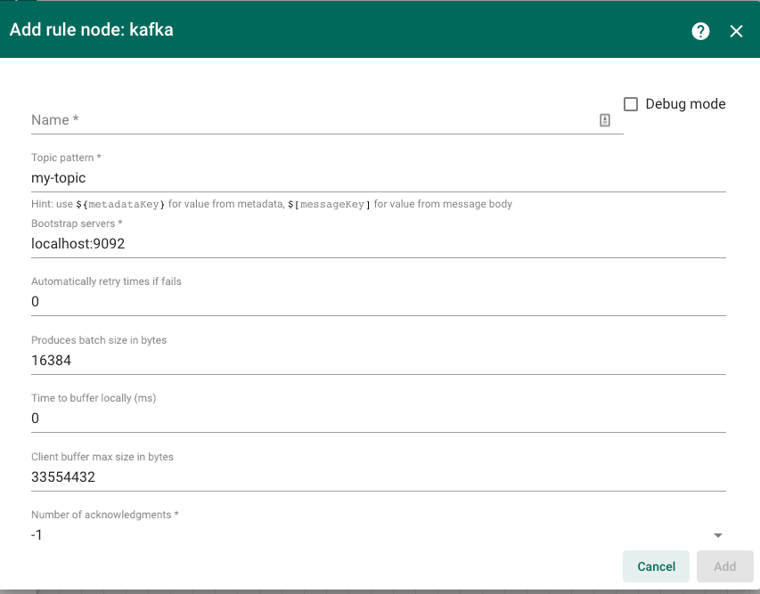
* Fill out the form as follows:
  - Name: `Kafka`
  - Topic pattern: `telemetry`
  - Bootstrap servers: Confluent Cloud cluster bootstrap server endpoint
  - Leave the rest of the prepopulated defaults alone
  - Under `Other properties`, add the following four to enable authentication to your Confluent Cloud cluster. Use the API key and secret created above in place of `CLUSTER_API_KEY` and `CLUSTER_API_SECRET`:
    - `ssl.endpoint.identification.algorithm`: `https`
    - `security.protocol`: `SASL_SSL`
    - `sasl.mechanism`: `PLAIN`
    - `sasl.jaas.config`: `org.apache.kafka.common.security.plain.PlainLoginModule required username="CLUSTER_API_KEY" password="CLUSTER_API_SECRET";`
  - Description: `Send telemetry to Confluent Cloud`
  - Click `Add`
* Click and drag a line from the right of the `Message Type Switch` node to the left of the `Kafka` node, and give it a label `Post telemetry`. Your rule chain should look like this:
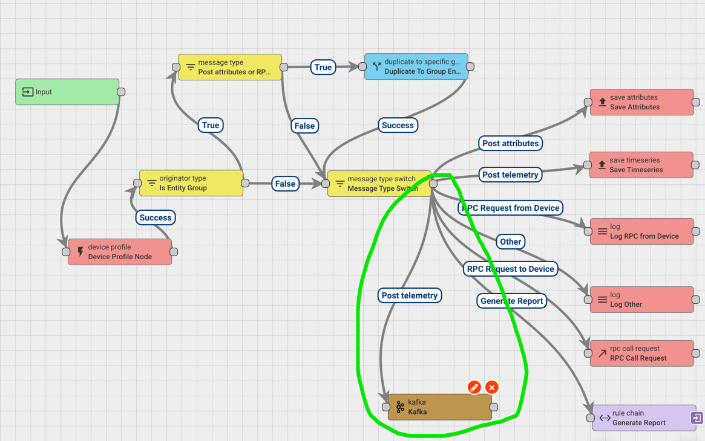
* Click the checkmark to apply your changes to the Root rule chain

## Run Fleet Simulator

* In ThingsBoard, navigate to `Device profiles` and click `+` to create a Device profile.
  - Give it a name for the kind of thing or vehicle tracked, e.g. "Truck"
  - Leave the rest of the `Device profile details` alone
  - Under `Transport configuration`, select `Transport type` MQTT. The simulator uses ThingsBoard's MQTT API.
  - Leave `Alarm rules` empty
  - Under `Device provisioning`, select `Allow to create new devices`. The simulator requires this in order to provision. Copy the `Provision device key` and `Provision device secret`. They are inputs to the simulator script.
  - Click `Add`
* Navigate to the `fleet-simulator` directory in this repo and install node dependencies:
  - `cd fleet-simulator && npm install`
* Optional: Generate a custom route (KML file) that your fleet will travel. This is an easy way to personalize demo for audience's location or area of interest.
  - In [Google Maps](https://www.google.com/maps), go to `Your places` and `MAPS`
  - Click `CREATE MAP`, zoom on an area, and click `Draw a line`, then `Add driving route`
  - Create a route that starts and ends on the same spot (double click on the last point of the route to close it). The simulator will put vehicles on this route in random locations and cycle through the loop, hence colocating start and end is recommended to avoid vehicle jumps.
  - Next to the map title, click the three dots, then `Export to KML/KMZ`
  - Check the `Export as KML instead of KMZ` box and download the KML file
  - Replace [route.kml](routes/route.kml) with this file
* Run the simulator. Pick a small number of vehicles, say less than 20. The vehicle type is just a label that you will see in ThingsBoard. You can ignore the MQTT endpoint if using ThingsBoard Cloud, though you'll need to set it if working against a self-managed ThingsBoard instance. The token prefix is used to generate access tokens for each vehicle. Leave this empty to let the simulator generate a random string, or manually set it if you'd like to use the same access tokens across simulator runs.
```
% node fleet-simulator.js --help
Options:
      --version                  Show version number                   [boolean]
  -n, --num-vehicles             number of vehicles in fleet          [required]
  -t, --vehicle-type             type of vehicle, e.g., "Truck"       [required]
  -m, --mqtt-endpoint            ThingsBoard mqtt endpoint
                                                  [default: "thingsboard.cloud"]
  -p, --token-prefix             ThingsBoard access token prefix      [required]
  -k, --provision-device-key     ThingsBoard provision device key     [required]
  -s, --provision-device-secret  ThingsBoard provision device secret  [required]
      --help                     Show help                             [boolean]
```
* Example simulator run:
```
node fleet-simulator.js --num-vehicles 5 --vehicle-type Truck --provision-device-key <PROVISION_DEVICE_KEY> --provision-device-secret <PROVISION_DEVICE_SECRET>
```
* Ensure no errors. Successful output looks like:
```
Client connected!
Provisioning Truck 0
Provisioning Truck 1
Provisioning Truck 2
Provisioning Truck 3
Provisioning Truck 4
request.topic: /provision/response
request.body: {"credentialsValue":"4ffbf691-d1e6-4e95-9cd6-dc4646ff04002","credentialsType":"ACCESS_TOKEN","status":"SUCCESS"}
Successfully provisioned Truck 2
request.topic: /provision/response
request.body: {"credentialsValue":"4ffbf691-d1e6-4e95-9cd6-dc4646ff04003","credentialsType":"ACCESS_TOKEN","status":"SUCCESS"}
Successfully provisioned Truck 3
request.topic: /provision/response
request.body: {"credentialsValue":"4ffbf691-d1e6-4e95-9cd6-dc4646ff04000","credentialsType":"ACCESS_TOKEN","status":"SUCCESS"}
Successfully provisioned Truck 0
request.topic: /provision/response
request.body: {"credentialsValue":"4ffbf691-d1e6-4e95-9cd6-dc4646ff04001","credentialsType":"ACCESS_TOKEN","status":"SUCCESS"}
Successfully provisioned Truck 1
request.topic: /provision/response
request.body: {"credentialsValue":"4ffbf691-d1e6-4e95-9cd6-dc4646ff04004","credentialsType":"ACCESS_TOKEN","status":"SUCCESS"}
Successfully provisioned Truck 4
```
* In ThingsBoard, navigate to `Device groups` > `All` and validate that you can see your fleet:
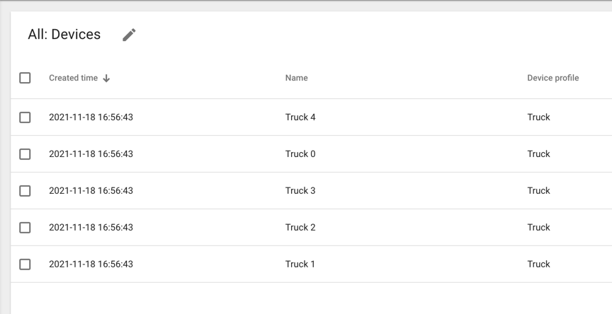
* Click on one of the vehicles and go to the `Latest telemetry` tab and validate that telemetry is showing up:
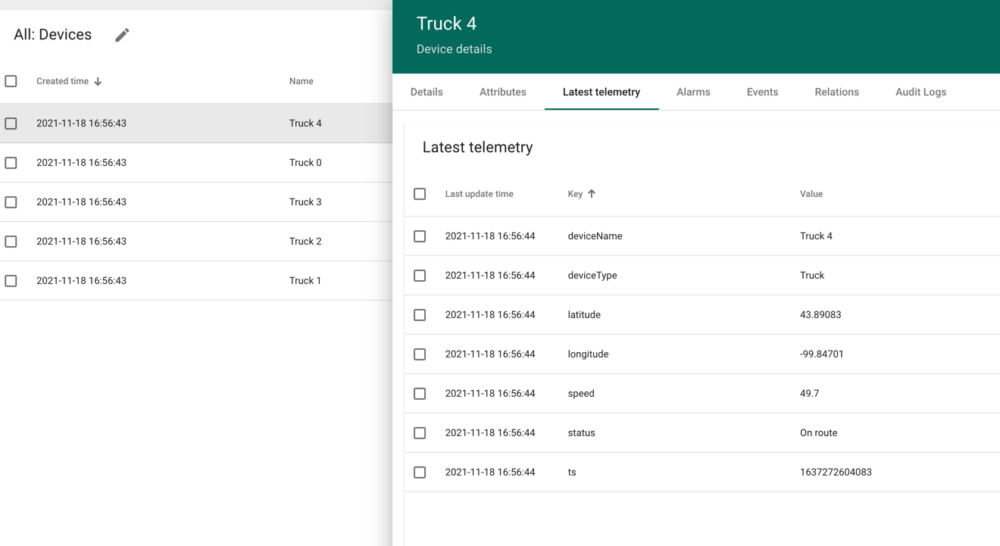
* In the Confluent Cloud Console, navigate to `Topics` and select `telemetry`. In the `Messages` tab, ensure that telemetry data is showing up by way of the Root rule chain edit we performed earlier:
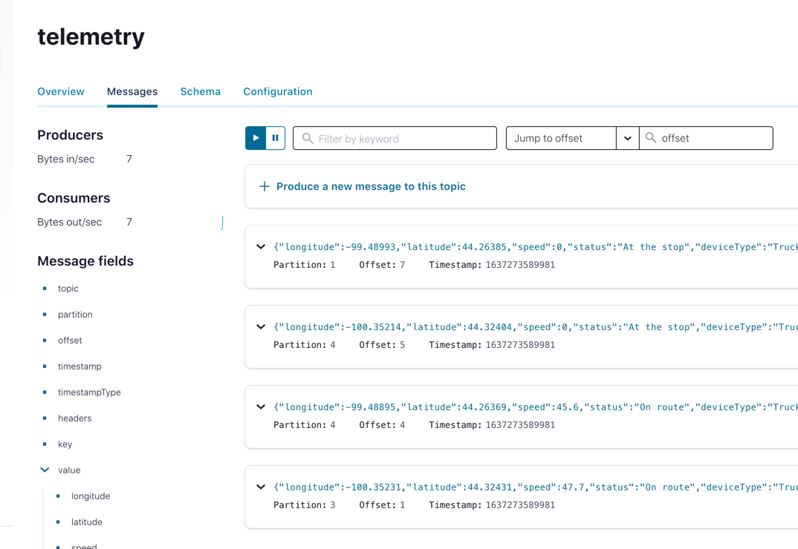

## ksqlDB App for Aggregate Metrics Calculation

* In the Confluent Cloud Console, select the ksqlDB application created earlier
* Create a stream from raw telemetry topic that we configured in the ThingsBoard Root rule chain:
```
CREATE STREAM telemetry (
	longitude DOUBLE,
	latitude DOUBLE,
	speed DOUBLE,
	status VARCHAR,
	deviceType VARCHAR,
	deviceName VARCHAR, ts BIGINT
) WITH (
	kafka_topic='telemetry',
	value_format='JSON',
	timestamp='ts'
);
```
* Create table for windowed aggregation (average speed):
```
CREATE TABLE avg_speed
WITH (
	kafka_topic='avg_speed',
	partitions=6,
	key_format='JSON',
	value_format='JSON'
) AS
SELECT
	deviceType,
	deviceName,
	status,
	AS_VALUE(deviceType) as device_type,
	AS_VALUE(deviceName) as device_name,
	AVG(speed) AS avg_speed,
	TIMESTAMPTOSTRING(WINDOWSTART, 'yyyy-MM-dd HH:mm:ss') as window_start
FROM telemetry
WINDOW TUMBLING (SIZE 30 SECONDS)
WHERE status = 'On route'
GROUP BY deviceType, deviceName, status
EMIT CHANGES;
```
* Set `auto.offset.reset` to `Earliest`, and add a query property `commit.interval.ms` set to `1000`, and run the query `SELECT * FROM avg_speed EMIT CHANGES;` Ensure that you get results:
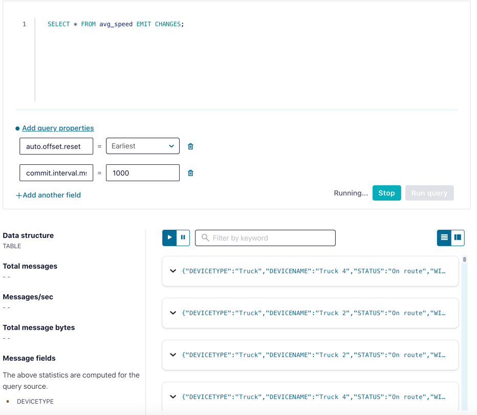
* `Stop` the query

## Integrate aggregated data back to ThingsBoard

In this section we'll send the aggregate metrics continuously generated by ksqlDB back to ThingsBoard as device attributes.

* In ThingsBoard, navigate to `Data Converters` and click `+` to add a converter
* Select `Import converter` and upload [converter.json](thingsboard-objects/converter.json). This converter gets used in the Kafka integration that we will configure next.
* Navigate to `Integrations` and click `+` to add a new integration and fill out the form:
  - Name: `Derived Metrics from Kafka`
  - Type: `Kafka`
  - Ensure that `Enabled` is checked
  - Uplink data converter: `AverageSpeedConverter`
  - No `Downlink data converter`
  - Leave `Execute Remotely` disabled
  - Leave `Group ID` and `Client ID` alone
  - Topics: `avg_speed` (the topic backing the `avg_speed` ksqlDB table)
  - Bootstrap servers: Confluent Cloud cluster bootstrap server endpoint
  - Leave Poll interval at 5000
  - Under `Other properties`, add the following four to enable authentication to your Confluent Cloud cluster. Use the API key and secret created above in place of `CLUSTER_API_KEY` and `CLUSTER_API_SECRET`:
    - `ssl.endpoint.identification.algorithm`: `https`
    - `security.protocol`: `SASL_SSL`
    - `sasl.mechanism`: `PLAIN`
    - `sasl.jaas.config`: `org.apache.kafka.common.security.plain.PlainLoginModule required username="CLUSTER_API_KEY" password="CLUSTER_API_SECRET";`
* Navigate to the integration's `Events` tab, select event type `Lifecycle event`, and ensure the integration has successfully started:
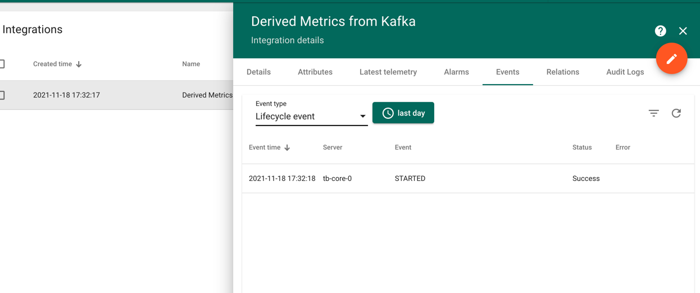
* Navigate to `Device groups` > `All` and select a vehicle. Go to its `Attributes` tab and validate that `recentAvgSpeed` and `recentAvgSpeedReportedTime` attributes show up as device attributes:
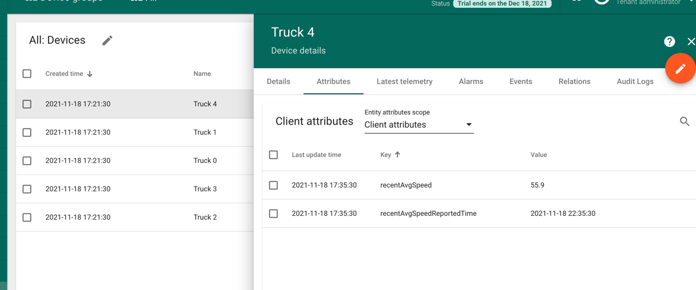
* That's it -- you have simulated telemetry going through ThingsBoard to Confluent Cloud, and back again!

## Create a ThingsBoard Dashboard

* In ThingsBoard, navigate to `Dashboard groups` > `All` and click `+` to create a new dashboard
* Give the dashboard a title like `Fleet Monitoring` and click `Add`
* Click on the dashboard and then `Open dashboard`
* Edit it and add a new widget. Under `Maps`, select `Trip Animation`
* In the `Timewindow` section, select `Realtime` over the last minute
* In the `Datasources` section, click `Entity alias`, and `Create a new one`
* Give the alias a name, and under `Filter type`, select `Device type` and pick your device type, toggle `Resolve as multiple entities` on, and click `Add`:
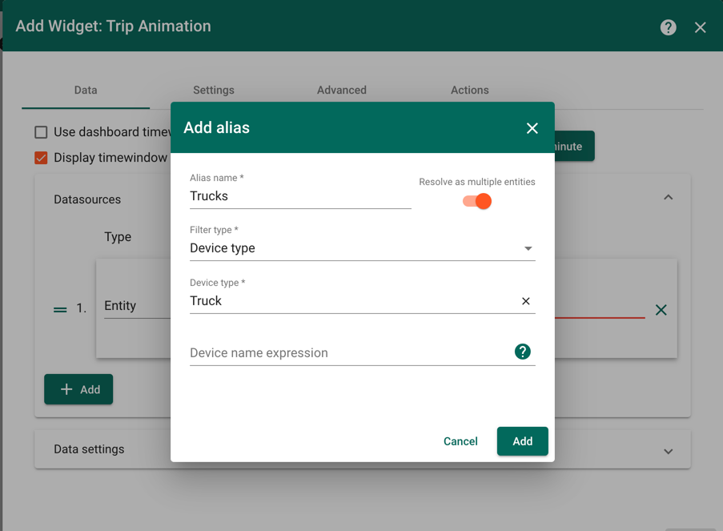
* In the `Entity timeseries are required` input, select all attributes and click `Add`:
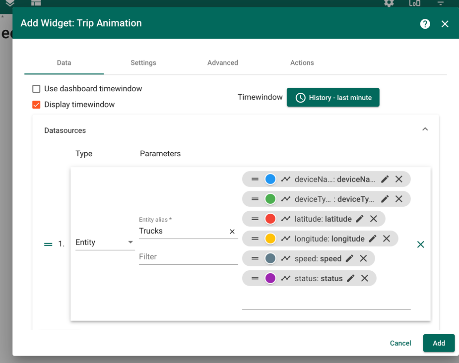
* You should see your fleet traveling around:
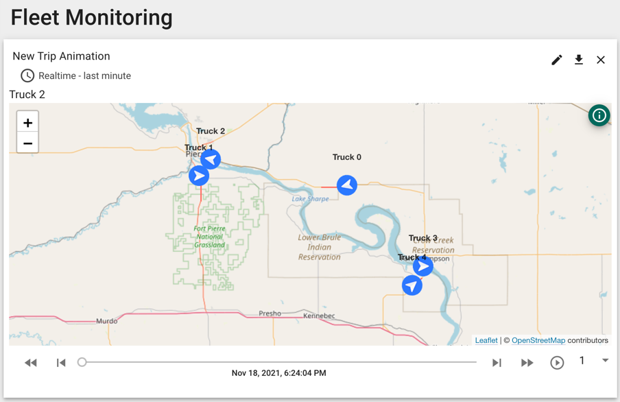
* Play around with other widgets! To see an example, click `Import dashboard` and import [fleet_monitoring.json](thingsboard-objects/fleet_monitoring.json). As expected, the recent average speed for each vehicle is less jumpy than the raw telemetry speeds that include stops and spurts:
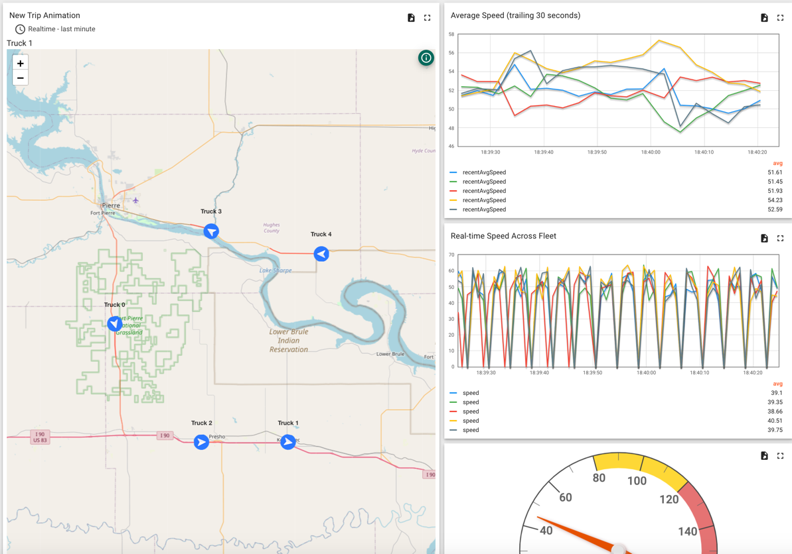
